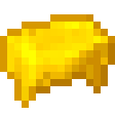

<h1 align="center">

 butter
</h1>

✨ smooth gliding animation for the selected hotbar slot indicator ✨

### Build Instructions
1. Clone the git repository
2. Navigate into the cloned directory
3. Run `./gradlew build`

The built jar file will be in `build/libs/`

---

### Unlicense
Released into the public domain.